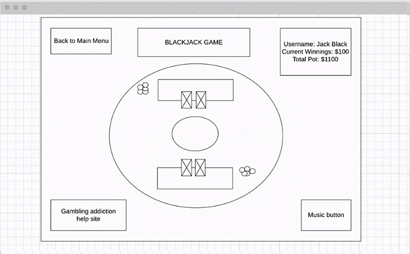

README.md 
# BlackJack 
An interactive game of blackjack

Felicia Walcott

<<<<<<< HEAD
Chase McFaddin

Kyle Atkinson

Scott Falbo
=======

+ **javascript**
+ *9/8 Scott and Kyle paired programming*
  + `DeckMaker` makes deck and puts cards in `deckArray`
  + the *player* and *dealer* objects holds current hand and total of held cards.
  + the bet button starts the initial deal.  The `getCard` function deals a card and removes it from the `deckArray` so it cannot be duplicated.  Once pushed the event listener is removed until next turn.
  + The *hit* button adds a card to the player.  If they have 21 the button does not work.
  + the *stay* button calls `dealerTurn()` and turns of the event listeners for *hit* and *stay*.
  
  > We left off on the `calcTotals()` functions.  It is suppose to compare totals and adjust bank roll accordingly.

+ **more JavaScript**
+ *9/9 paired by Chase and Kyle then mobbed for group*
+ Added a shuffle deck function that randomly switches two cards 1000 times.
+ `playerHit()` player can draw cards until the hit 21 or bust
+ `playerStay()` dealer draws cards until total is greater than 16.
+ `calcTotal()` compares handTotals and does the appropriate thing based on the condition.
+ `nextTurn()` ends current turn and waits for another bet

+ **game page CSS**
+ *9/9.  Worked on by Scott during lab time and all night.*
+ Elements by ID for JavaScript targeting:
  + `<section id="dealerhand">` append cards as `
`
  + `<section id="playerhand">` append cards as `
`
  + `<figure id="chips">` append chip stack. *stretch goal*
  + `<form id="playerbet">` eventHandler to get bet amount
  + `
` eventHandler for hit function 
  + `
` eventHandler for stay function 
  + `<ul id="playerinfo">`
    + `innerHTML.child[2] = player name`
    + `innerHTML.child[4] = bankroll`
    + `innerHTML.child[6] = hand played` *stretch goal*
  + `<ul id="gamehistory">` append `<li>` to top of list
+ did most of the styling on the `game.html` and started doing some interactive transforms.

+ New goals, tasks and issues to fix:
  + the `aceAdjuster()` method needs to adjust `target.handTotal`
  + output game history to `<ul id="gamehistory">`
    + player hits, player stays, dealer hits, etc.
  + set up local storage.  Two keys, one for player object and one for high score list.
  + code bet input form.  Check to make sure the amount isn't <5 or >bankroll.
    + `form id="playerbet"`
  + when the player or dealer has more than 3 cards they need to collapse.  I think a JavaScript conditional that changes the relative position will work.
  
+ *9/10 updates*
  + Card face image assets from:
    + [github.com/hayeah/playing-cards-assets](https://github.com/hayeah/playing-cards-assets)
  + concatenated an image path string inside the card objects.
  + moved the DOM append to it's own `appendCard()` function, added a `.createElement('img')` and set the source to respective card objects `imgSrc`
  + Added a conditional to `appendCard()` that deals the dealers first card face down.  It is later exposed after the player stays.
  + added flipping animation by making a stack of containers and using `className.toggle` from javascript to flip them.
>>>>>>> adaa3577b7a07a8f845a0f2e8a431aa12f767246

javascript

<<<<<<< HEAD
9/8 Scott and Kyle paired programming

DeckMaker makes deck and puts cards in deckArray
the player and dealer objects holds current hand and total of held cards.
the bet button starts the initial deal. The getCard function deals a card and removes it from the deckArray so it cannot be duplicated. Once pushed the event listener is removed until next turn.
The hit button adds a card to the player. If they have 21 the button does not work.
the stay button calls dealerTurn() and turns of the event listeners for hit and stay.
We left off on the calcTotals() functions. It is suppose to compare totals and adjust bank roll accordingly.

more JavaScript

9/9 paired by Chase and Kyle then mobbed for group

Added a shuffle deck function that randomly switches two cards 1000 times.

playerHit() player can draw cards until the hit 21 or bust

playerStay() dealer draws cards until total is greater than 16.

calcTotal() compares handTotals and does the appropriate thing based on the condition.

nextTurn() ends current turn and waits for another bet

game page CSS

9/9. Worked on by Scott during lab time and all night.

Elements by ID for JavaScript targeting:

<section id="dealerhand"> append cards as 

<section id="playerhand"> append cards as 

<figure id="chips"> append chip stack. stretch goal
<form id="playerbet"> eventHandler to get bet amount

 eventHandler for hit function

 eventHandler for stay function
<ul id="playerinfo">
innerHTML.child[2] = player name
innerHTML.child[4] = bankroll
innerHTML.child[6] = hand played stretch goal
<ul id="gamehistory"> append <li> to top of list
did most of the styling on the game.html and started doing some interactive transforms.

New goals, tasks and issues to fix:

the aceAdjuster() method needs to adjust target.handTotal
output game history to <ul id="gamehistory">
player hits, player stays, dealer hits, etc.
set up local storage. Two keys, one for player object and one for high score list.
code bet input form. Check to make sure the amount isn't <5 or >bankroll.
form id="playerbet"
when the player or dealer has more than 3 cards they need to collapse. I think a JavaScript conditional that changes the relative position will work.
9/10 updates

Card face image assets from:
github.com/hayeah/playing-cards-assets
concatenated an image path string inside the card objects.
moved the DOM append to it's own appendCard() function, added a .createElement('img') and set the source to respective card objects imgSrc
Added a conditional to appendCard() that deals the dealers first card face down. It is later exposed after the player stays.
added flipping animation by making a stack of containers and using className.toggle from javascript to flip them.
=======
      

>>>>>>> adaa3577b7a07a8f845a0f2e8a431aa12f767246
